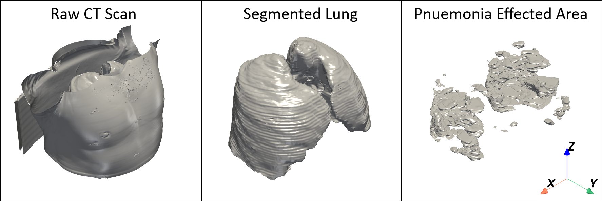
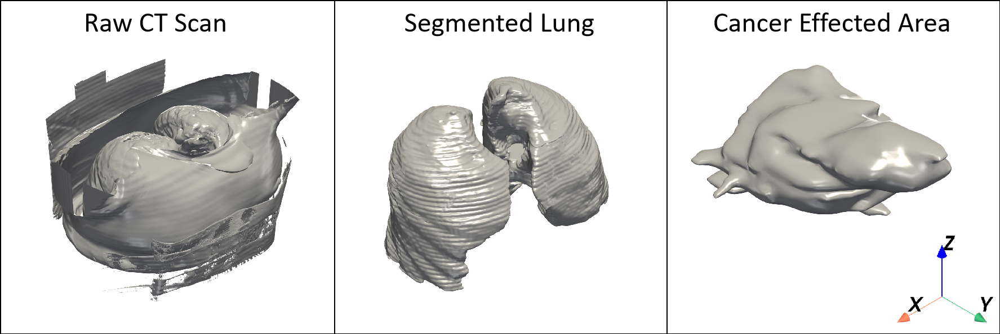
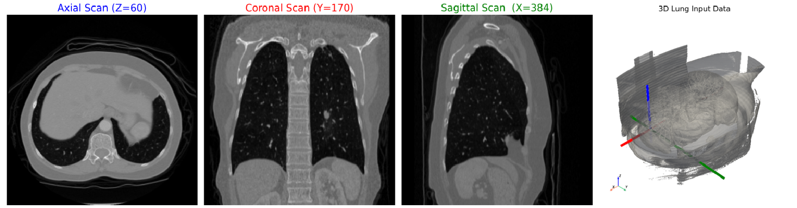
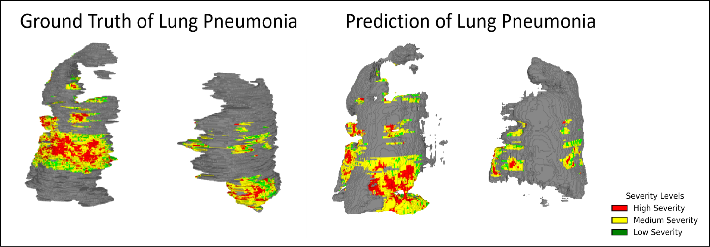
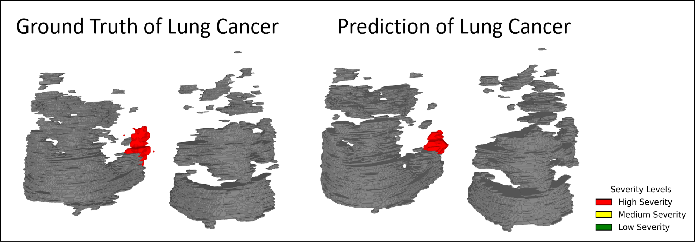

# Multi-Disease Lung Segmentation and Reconstruction

<div align="center">


**Advancing Medical Imaging with AI-Powered 3D Lung Analysis**

*Nikhileswara Rao Sulake, Partha Acharya, Subhamoy Mandal*

*Developed at School of Medical Science and Technology, Indian Institute of Technology, Kharagpur, India*

</div>

---

## 🔬 Research Overview

This repository presents a groundbreaking approach to medical image analysis that combines the power of deep learning with advanced surface topology algorithms to revolutionize lung disease diagnosis and treatment planning. Our research introduces a unified pipeline that integrates 2D CT-slice segmentation with 3D surface reconstruction, producing anatomically accurate, color-coded lung models that highlight infection severity and disease progression.

The work addresses critical challenges in medical imaging including variability in CT image quality, difficulties in handling pathological cases, limited annotated datasets, high computational demands, and the absence of standardized AI models. By leveraging U-Net's encoder-decoder architecture for precise segmentation and combining it with surface topology-based reconstruction algorithms, we achieve unprecedented accuracy in identifying lung structures and pathologies.



**Fig. 1:** These are Lung CT data in the COVID-19 Pneumonia dataset.  
- The **first** image (left) is the **raw CT scan** of the patient  
- The **middle** image shows the **lung region** extracted from the raw scan  
- The **third** image displays the **pneumonia-affected regions**


Our methodology represents a significant advancement in automated lung analysis, enhancing diagnostic accuracy and clinical decision-making through high-quality 3D reconstructions. The integration of deep learning with topology-driven reconstruction provides a robust foundation for improved medical imaging applications, supporting precise disease assessment and facilitating applications in detection, surgical planning, education, and computational medicine.



**Fig. 2:** These are Lung CT data in the Lung Cancer (Medical Decathlon) dataset.  
- The **first** image (left) is the **raw CT scan** of the patient  
- The **middle** image shows the **lung region** extracted from the raw scan  
- The **third** image displays the **lung-cancer-affected regions**
---

### 🧮 Mathematical Intuition Behind Reconstruction

---

#### 🔷 Radial Basis Function (RBF) Interpolation

Radial Basis Function (RBF) is a powerful interpolation method used for smooth surface reconstruction from scattered data points. It defines an implicit function that approximates the 3D surface based on control points.

The RBF depends on the distance between a surface point `x` and a control center `c`: r = ||x - c||

The general form of the RBF interpolant is given by: f(x) = K(x, y)a + P(x)b


Where:

- `K(x, y)`: Matrix of RBFs with centers at `y` evaluated at `x`  
- `P(x)`: Polynomial basis (monomials) evaluated at `x`  
- `a`, `b`: Coefficients found by solving:

(K(y, y) + λI)a + P(y)b = d

P(y)^T a = 0

Here:

- `d`: Data values at known locations `y`  
- `λ`: Smoothing parameter (controls surface fitting rigidity)

A well-chosen shape parameter influences the width of the RBF — smaller values result in broader basis functions, which smooth the surface more globally.

---

#### 🔷 Ball Pivot Algorithm (BPA)

The Ball Pivot Algorithm is a lightweight yet effective surface reconstruction algorithm that generates a mesh from a point cloud or STL data. It simulates a ball of radius `r` pivoting across the surface points.

**Steps:**

1. **Seed Triangle Formation:**  
   The ball "rolls" over the point cloud until it gets caught between three surface points, forming a triangle where no other point lies inside the ball. This triangle is the seed.

2. **Triangle Expansion:**  
   The ball pivots around edges of the existing triangle to find new points that can form additional valid triangles. It continues this process, expanding the mesh surface.

3. **Repeat:**  
   Once expansion halts, the algorithm finds a new seed triangle and repeats until the surface is complete.

This method ensures watertight and accurate reconstruction while maintaining computational efficiency.


---


### Key Features:

*   **U-Net Based Segmentation:** Utilizes a U-Net based deep learning model for precise segmentation of COVID-19 lesions, pneumonia, and lung cancer from 2D CT slices.
*   **3D Surface Reconstruction:** Employs the Marching Cubes algorithm to convert segmented voxel data into continuous surface meshes, followed by Radial Basis Function (RBF) interpolation and the Ball-Pivot Algorithm (BPA) for smoothing and watertight mesh generation.
*   **Hounsfield Unit (HU) based Color Coding:** Visualizes disease severity by color-coding 3D lung models based on Hounsfield Unit thresholds (green for less severe, yellow for mildly infected, red for severely infected regions).
*   **Multi-Disease Analysis:** Capable of segmenting and analyzing both lung cancer and pneumonia/COVID-19 infections.
*   **Robustness:** Designed to handle variability in CT image quality and pathological cases, ensuring robust segmentation even with lung deformations.

---

## 🚀 Technical Details

### Segmentation Module (`Pnuemonia_and_Cancer_Segmentation`)

This module focuses on the 2D segmentation of lung CT slices using U-Net models. It includes:

*   `Models/unet_family_models.py` and `Models/unet_model.py`: Implementations of U-Net architectures used for segmentation.
*   `dataloader.py`: Handles data loading and preprocessing for both Lung Cancer and COVID-19 datasets.
*   `train_code.py` and `test_code.py`: Scripts for training and evaluating the segmentation models.
*   `cancer and covid training.ipynb`: Jupyter notebook for interactive training and experimentation.

### Reconstruction Module (`Pnuemonia_and_Cancer_Reconstruction`)

This module is responsible for generating 3D lung models from the 2D segmented slices and performing surface reconstruction. Key components include:

*   `main.py`: Orchestrates the entire 3D reconstruction pipeline, from downloading datasets to generating STL files and point clouds.
*   `3dMesh_visualization.py`: Utilities for visualizing 3D meshes.
*   `rbf_helper_functions.py`: Helper functions for Radial Basis Function (RBF) interpolation, crucial for smoothing reconstructed surfaces.

### Classification Module (`Pnuemonia_Classification`)

This module focuses on the classification of pneumonia using various deep learning models. It includes:

*   `Models/mobilenetv2_model.py`, `Models/resnet_model.py`, `Models/shufflenet_model.py`: Implementations of different classification models.
*   `dataloader.py` and `dataset_creator.py`: Handle data loading and combining multiple pneumonia datasets.
*   `train_code.py`: Script for training the classification models.

---

## 📂 Repository Structure

```
Multi-Disease-Lung-Segmentation-and-Reconstruction/
├── Pnuemonia_and_Cancer_Reconstruction/
│   ├── __init__.py
│   ├── 3dMesh_visualization.py
│   ├── main.py
│   └── rbf_helper_functions.py
├── Pnuemonia_and_Cancer_Segmentation/
│   ├── Models/
│   │   ├── __init__.py
│   │   ├── unet_family_models.py
│   │   └── unet_model.py
│   ├── __init__.py
│   ├── cancer and covid training.ipynb
│   ├── dataloader.py
│   ├── main.py
│   ├── metrics.py
│   ├── test_code.py
│   └── train_code.py
├── Pnuemonia_Classification/
│   ├── Models/
│   │   ├── __init__.py
│   │   ├── mobilenetv2_model.py
│   │   ├── resnet_model.py
│   │   └── shufflenet_model.py
│   ├── __init__.py
│   ├── dataloader.py
│   ├── dataset_creator.py
│   ├── main.py
│   └── train_code.py
├── LICENSE
├── README.md
└── requirements.txt
```

---

### 📚 Dataset Summary

The following table shows the number of images used for training, validation, and testing for both Lung Cancer and COVID-19 segmentation:

| Dataset Split | Lung Cancer | COVID-19 |
|---------------|-------------|----------|
| Train         | 53,409      | 16,985   |
| Validation    | 12,326      | 3,920    |
| Test          | 16,434      | 5,226    |
| **Total**     | **82,169**  | **26,131** |


#### 🔍 3D CT Scan Orientation Views



**Fig. 3:** Axial, Coronal, and Sagittal are the three primary views for analyzing any 3D medical volume.  
- The **first** image shows the **axial slice** (Z=60)  
- The **second** is the **coronal slice** (Y=170)  
- The **third** is the **sagittal slice** (X=384)  
- The **last** shows the 3D volume with overlaid slice planes and directional axes.


---

## 📊 Results and Visualizations

To assess the effectiveness of our model, we evaluated its performance across training, validation, and testing datasets. The metrics include Dice Score, Intersection-over-Union (IoU), Accuracy, and Loss. The results, presented in the table below, demonstrate a consistent improvement in segmentation performance through all phases, especially highlighted by a high Dice score and low testing loss. These findings validate the robustness of our approach.

| Dice Scores         | **Training**                              | **Validation**                     | **Testing**                          |
| -------------- | ----------------------------------------- | ---------------------------------- | ------------------------------------ |
| **Lung Cancer** | 0.5977 | 0.8769 | 0.8837 |
| **Lung Pneumonia**        | 0.6294   | 0.6252   | 0.6168   |


#### 🎯 Prediction vs Ground Truth - Pneumonia (3D)



**Fig. 4:** 3D Predictions compared with Ground Truth from the RBF Algorithm for Lung Pneumonia.  

#### 🎯 Prediction vs Ground Truth - Cancer (3D)



**Fig. 5:** 3D Predictions compared with Ground Truth from the RBF Algorithm for Lung Cancer. 


## 🎓 Academic Contributions

This work was conducted as part of an internship at IIT Kharagpur, under the guidance of:

*   **Dr. Subhamoy Mandal**
*   **Mr. Partha Acharya** 

### Citation

*(Paper not yet published. Citation and paper link will be provided here upon publication.)*

---

## 🤝 Contributing

We welcome contributions to this project! Please feel free to fork the repository, open issues, or submit pull requests.

---

## 📄 License

This project is licensed under the [LICENSE](LICENSE) file.

